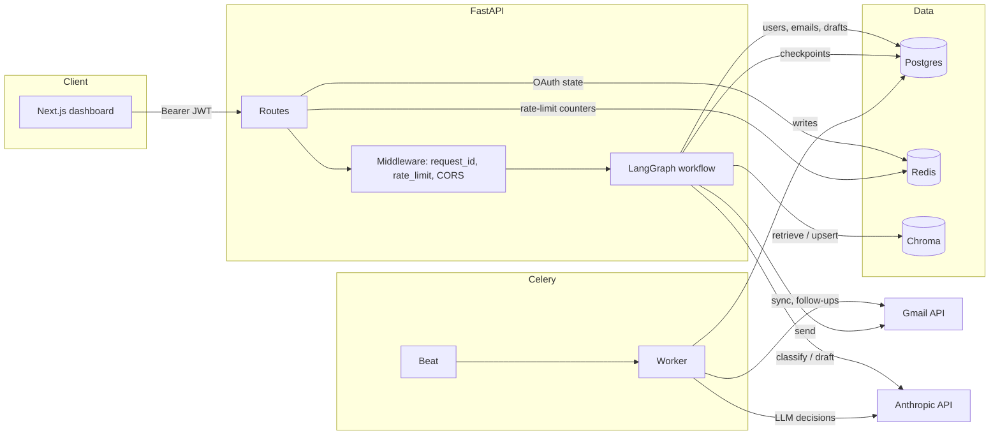
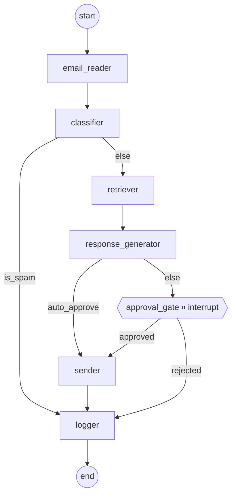
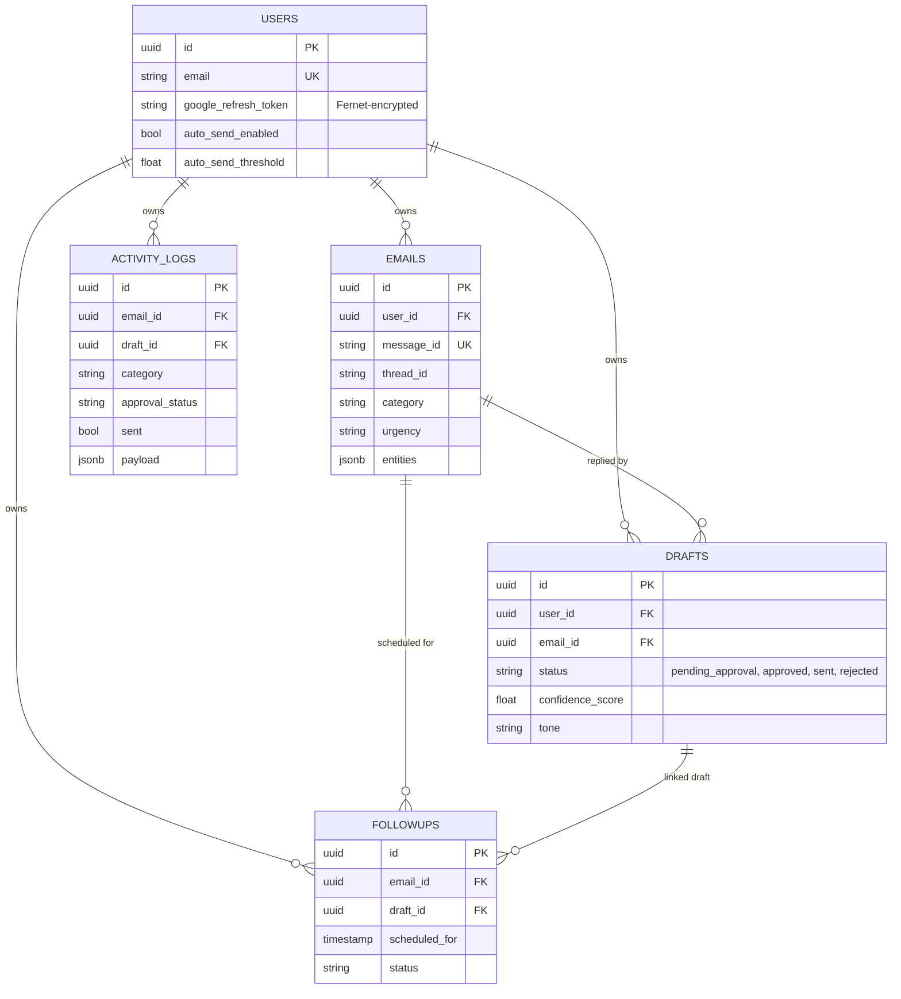

# Architecture

## Components

## Agent workflow (LangGraph)

Pause point: `interrupt_before=["approval_gate"]`. On resume, the API calls
`graph.aupdate_state(...)` to set `approval_status`, then `graph.ainvoke(None, config)`
to continue.

## Data model

## Request lifecycle

1. Client sends `Authorization: Bearer <JWT>` to `/api/...`.
2. `RequestContextMiddleware` generates a `request_id` (or honors incoming `X-Request-ID`),
   binds it to the structlog contextvars, logs `http.request.start`.
3. `SlowAPIMiddleware` evaluates the per-route limit (counter in Redis when configured).
4. CORS middleware applies origin checks.
5. Route handler executes; for protected routes, `get_current_user` validates the JWT
   and loads the user from Postgres.
6. On completion, middleware appends `X-Request-ID` and logs `http.request.end` with
   `status_code` and `elapsed_ms`.

## Token security

- Google `refresh_token` is encrypted with Fernet before being stored on the `users` row.
- The Fernet key is derived from `APP_SECRET_KEY` via SHA-256 → base64. Rotating
  `APP_SECRET_KEY` invalidates all stored tokens — users must re-authorize.
- JWT (HS256) is signed with the same `APP_SECRET_KEY`; default TTL 7 days.
- OAuth `state` is single-use, Redis-backed with a 10-minute TTL (falls back to
  in-process memory only when Redis is unreachable; log line surfaces the misconfig).
